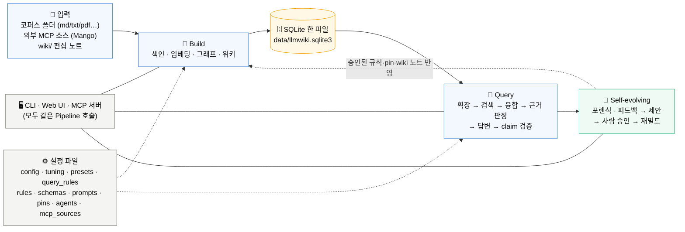
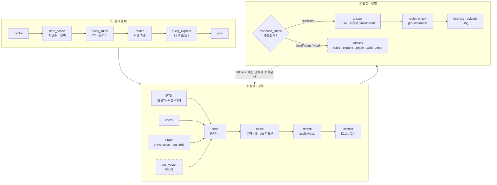
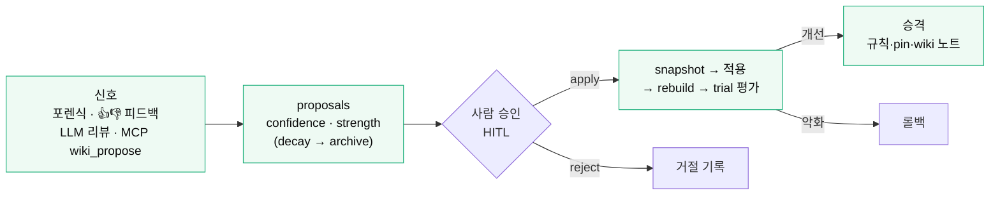

# Architecture v3 — 전체 구조와 흐름

> v2(2026-09-11) 이후 추가된 v3 기능(문서 계약·provenance·임베딩 캐시/재개·규칙/LLM 질의 확장·근거 판정/fallback·claim 검증·포렌식·메모리·trial·프리셋·headless 에이전트·MCP 소스·워크플로 UI·테마)을 포함한 최종 구조. 단계별 CLI 예제는 [CLI_FLOWS.md](CLI_FLOWS.md), 포팅은 [BRINGUP_GUIDE.md](BRINGUP_GUIDE.md), 이전 구조는 [ARCHITECTURE_V2.md](ARCHITECTURE_V2.md).

**읽는 법** — 처음이면 §0 용어 → §1 전체 그림 → §9 "한 질의의 여정" 순으로 읽고, 코드를 볼 때 §2 모듈 지도, 운영할 때 §4·§5 단계 표(단계 이름 = `--trace` 와 Web 프로파일에 나오는 이름)를 참조한다.

## 0. 핵심 용어

| 용어 | 뜻 |
|---|---|
| 코퍼스 / 문서 / 청크 | 색인 대상 폴더의 파일 / 파일 하나 / 헤딩 단위로 자른 검색 단위(`[C1]` 처럼 인용됨) |
| 문서 계약 (front matter) | 문서 맨 위 `---` 블록의 `doc_type`, `id`, `date`, `related` 등. 지키면 ID 노드·결정적 관계·시간 검색이 켜진다 ([CORPUS_CONTRACT.md](CORPUS_CONTRACT.md)) |
| 채널 | 후보를 내는 검색 방식: FTS(키워드, BM25) · Vector(의미 임베딩) · Graph(엔티티·관계 탐색) · doc_vector(문서 카드) |
| 융합 / 부스트 / 리랭크 | 채널별 순위를 하나로 합침(RRF 등) → 문서유형·시간·pin 등 배율 → 상위 후보 재정렬 |
| provenance | 그래프 간선의 출처: explicit(front matter) · rule(ID 패턴) · cooccur(공동출현) · llm · human. 신뢰도 순으로 탐색 가중 |
| 근거 판정 (evidence_check) / fallback | 검색 결과가 답하기에 충분한지 판정 → 부족하면 규칙확장→LLM확장→그래프→광역→MCP 순으로 재검색 |
| groundedness / claim_check | 답변 문장 중 인용 근거가 실제로 뒷받침하는 비율 / 그 검증 절차. 미지원 문장은 `[미확인]` 표기·제거·재작성 |
| 포렌식 | "왜 답을 못 만들었나"를 단계별로 진단해 남긴 기록. 누적되면 제안의 재료 |
| 제안 / HITL | 시스템이 만든 개선안(동의어·관계·코퍼스 갭·튜닝). 사람이 승인해야 적용(Human-in-the-loop) |
| 토글 / 튜닝 / 프리셋 | 단계 on/off 스위치(56개) / 알고리즘 상수(130+) / 둘을 묶은 이름(quality·speed·token·offline·deep_research) |
| request_id / run_id | 요청별 프로파일 기록 번호(`requests` 명령) / 같은 요청의 로그 줄을 묶는 ID(`logs grep --request`) |
| trial | 설정 스냅샷 + 평가 지표를 저장한 것. 두 trial 을 비교해 튜닝 효과를 판단 |

## 1. 전체 구성

### 1.1 큰 그림 — 문서가 답변이 되기까지



원칙: **CLI = Web = MCP = eval = trial** 모두 `Pipeline.build()` / `Pipeline.query()` 하나를 호출한다. 모든 단계는 토글로 on/off 되고 프로파일 trace(요청별 `request_id` + 로그의 `run_id`)를 남긴다.

### 1.2 Build 파이프라인 (`python -m llmwiki build`)


점선 = 기본 OFF 또는 조건부. 산출물은 전부 SQLite 테이블(§3)과 `wiki/*.md`.

### 1.3 Query 엔진 (`python -m llmwiki query "…"`)



### 1.4 Self-evolving (`evolve` · `memory`)



한 줄 요약:

```
build : health → [mcp_ingest] → load_corpus → diff → chunk_index → embed → graph_build → [doc_vectors] → wiki_pages → prune → verify → warm → [precompute]
query : cache → time_scope → query_rules → router → [query_expand] → pins → fts | vector | graph | [doc_vector] → fuse+boost → rerank → context → evidence_check → [fallback] → answer → claim_check → forensic → evolve_capture → log
evolve: capture | feedback | llm_review | forensics → proposals(strength, decay) → HITL apply → snapshot → rebuild → trial → 승격 | 롤백
```
`[ ]` 는 기본 OFF 이거나 조건부로 실행되는 단계.

## 2. 모듈 지도

| 영역 | 모듈 | 역할 |
|---|---|---|
| 설정 | `config.py` `presets.py` `tuning.py` `prompts.py` | Settings/Toggles(56 토글) · env 오버라이드 · 경로 레지스트리 · 프리셋 · 튜닝 레지스트리(130+) · 프롬프트 파일 |
| 로그/프로파일 | `logging_setup.py` `profiler.py` `buildlock.py` `health.py` | JSONL 로테이션 로그 + run_id · 단계 trace · 빌드 락 · health 검사 |
| 코퍼스 | `corpus.py` `schema.py` `mcp_client.py` | 로더/청커 · front matter/스키마/lint/추론/마이그레이션 · MCP 소스 ingest/enrich |
| 저장 | `store.py` | SQLite 스키마·마이그레이션 · FTS5(+trigram) · 벡터(float32/16) · 그래프 · doc_meta · 임베딩 캐시 · forensics/episodes/trials/answer_cache · verify |
| 빌드 | `pipeline.py` `embed_run.py` `graph_rules.py` `graph_build.py` `graph_llm.py` `wiki.py` `precompute.py` | 빌드 오케스트레이션 · 임베딩 러너 · 규칙/ID/explicit 관계 · LLM 추출 · 커뮤니티 · 위키 · 문서 카드 벡터/답변 캐시 |
| 검색 | `query_engine.py` `retrieval.py` `fusion.py` `query_rules.py` `timeparse.py` `pins.py` `rerankers.py` | 질의 오케스트레이션 · 라우터/FTS/벡터/그래프 · 융합/부스트 · 규칙 확장 · 시간 파싱 · pin · rerank API |
| 답변 | `answer.py` `evidence.py` `forensic.py` | 컨텍스트/답변/claim 검증 · 충분성 판정/fallback 예산 · 포렌식 진단/기록 |
| 진화 | `evolve.py` `memory.py` `trials.py` `evalset.py` | 제안/적용/롤백 · 에피소드/decay/consolidate · trial 비교 · 지표 |
| 프로바이더 | `providers.py` `headless.py` | Anthropic(SDK/HTTP, 게이트웨이 `anthropic_base_url`) · OpenAI-compatible(PAT 헤더 `openai_api_key_header`) · Ollama · Voyage · ST · hash · headless 에이전트(subprocess, Windows `.cmd`) · mock · `live_test()` |
| 진행/보안 | `progress.py` `auth.py` `snapshots.py` | 실시간 진행 레지스트리(단계·진도율·LLM 대기, CLI 모니터/Web 폴링) · 로그인(로컬+SSO)·역할·작업 등급 게이트·감사 로그 · 파괴적 작업 전 스냅샷 |
| 인터페이스 | `cli.py` `web/server.py` `web/static/*` `mcp.py` `architecture.py` | argparse CLI(45+ 명령) · HTTP API + 워크플로 UI(로그인 페이지, 단계 확인 모달) · MCP 도구 7종 · 구조 레지스트리 |

## 3. 데이터 모델 (SQLite)

| 테이블 | 키 컬럼 | 용도 |
|---|---|---|
| `docs` | doc_id, hash, mtime, size, title, kind, meta | 문서 목록 · 증분 diff |
| `doc_meta` | doc_id, doc_type, ext_id, date/ts, tags, modules, hw_*, related, lint | 문서 계약 정규화 메타 (시간/유형 부스트, ID 노드, lint) |
| `chunks` / `chunks_fts` / `chunks_tri` | chunk_id, heading, text / FTS5(heading, body, tokens+메타토큰) / trigram 폴백 | 청크와 색인 |
| `embeddings` / `embedding_cache` / `doc_vectors` | chunk_id, provider, dim, vec / (provider, model, sha) / doc_id | 벡터(float32 또는 float16) · 내용 해시 캐시 · 문서 카드 벡터 |
| `entities` / `entities_fts` | entity_id, name, type, aliases, degree, community, doc_refs, n_docs | 노드(문서 ID 노드 포함) + 원본 문서 참조 |
| `relations` | src, dst, rel, weight, confidence, **provenance**(explicit/rule/cooccur/llm/human), chunk_id | 간선 |
| `mentions` / `communities` | entity↔chunk / community 요약 | 그래프 검색 · 위키 |
| `requests` | id, kind, run_id, summary, ms, tokens, config, result, trace | 요청별 프로파일 (Web/CLI `requests`) |
| `query_log` / `episodes` | 질의·피드백 / 에피소드(strength, last_reinforced) | 자가진화 입력 · 피드백 부스트 |
| `forensics` | request_id, run_id, verdict, groundedness, findings, suggestions, topics | 포렌식 누적 → consolidate |
| `proposals` / `evolution_log` / `synonyms` | kind, payload, confidence, status, **strength** | 제안(HITL) · 이력 |
| `trials` | name, build_version, config 스냅샷, summary, rows | 회귀 비교 |
| `answer_cache` / `embed_runs` / `kv` | 사전 계산 답변 / 임베딩 실행 이력 / build_version·last_build·embed_progress·lint_summary·hash_idf | 캐시·상태 |

## 4. 빌드 흐름 (단계 = trace 이름)

| 단계 | 하는 일 | 토글 | 실패/중단 시 |
|---|---|---|---|
| `health` | Python/FTS5/DB 무결성/WAL/디스크/코퍼스/벡터 메모리/임베딩 차원/(빌드 역할) LLM·임베더·rerank·MCP ping | `health_check` | fail 이면 빌드 시작 안 함(초기화 전) · `--force` |
| `mcp_ingest` | MCP 소스 tool 호출 → `data/mcp_cache/<src>/<type>/<id>.md` | `mcp_sources` | 소스별 오류는 alerts |
| `load_corpus` | 재귀 스캔, stat_skip, front matter 파싱, 위키 노트 overlay | `stat_skip` | – |
| `diff` | 해시 비교 → changed/removed/renamed | `incremental` | – |
| `chunk_index` | 삭제 문서 정리 → 청킹 → FTS(+메타 토큰, trigram) → doc_meta + lint | `schema_lint` `fts_trigram` | lint error 는 alerts |
| `embed` | 캐시 조회 → 적응형 배치 임베딩 → N 배치마다 commit/진행률/WAL → 실패 청크 기록 | `embed` `embed_adaptive` | 중단 후 다음 build 가 missing 만 재개 |
| `graph_build` | rule_extract(사전·정규식·ID 패턴·explicit related) → llm_extract → degrees → doc_refs → communities | `rule_graph` `llm_graph` `explicit_relations` `communities` | LLM 실패는 skip 카운트 |
| `doc_vectors` | 문서 카드 임베딩 | `doc_vector` | – |
| `wiki_pages` | 엔티티 페이지(변경분) + INDEX | `wiki_pages` | – |
| `prune` | 고아 엔티티(+stale 위키 페이지)·댕글링·타 프로바이더 벡터·FTS optimize·WAL checkpoint | `fts_optimize` | – |
| `verify` | 정합성 요약 (문제는 alerts, `build verify --fix`) | `verify_after_build` | – |
| `warm_cache` / `precompute` | 벡터 행렬·엔티티 인덱스 예열 / 답변 사전 계산 | `warm_cache` `precompute_after_build` | – |

## 5. 질의 흐름 (단계 = trace 이름)

| 단계 | 하는 일 | 토글 · 튜닝 |
|---|---|---|
| `sync_index` `providers` | 다른 프로세스 빌드 감지 · 역할별 LLM 준비 | – |
| `cache_hit` / `precompute_hit` | 메모리 캐시 / 영속 답변 캐시 | `query_cache` `precompute` |
| `time_scope` | "지난주/2026년 8월/Q3" → 날짜 범위, 검색 질의에서 제거 | `time_scope` · `time_mode` `time_boost_w` |
| `query_rules` | acronym(구문 OR·치환 alt) / synonym(OR syn_w·alt) / alias(치환·시드) / related(보조 리스트) / exclude(NOT+페널티) | `query_rules` `profile_expansion` · `syn_w` `related_w` `exclude_penalty` |
| `router` | 키워드/엔티티/관계어/숫자 → 채널 가중 + 문서유형 힌트 (+LLM 의도) | `router` `router_llm` · `router_*` `channel_w_*` |
| `query_expand` | LLM 추가 질의 n개 + sub-query 분해 (원 질의 유지) | `query_expand` `query_decompose` · `query_expand_n/w` |
| `pins` | 조건부 고정 근거 주입 | `pins` · `pin_boost` |
| `fts_search` `fts_search_rules` `fts_search_alt` `fts_search_related` | 원 질의 tiered FTS · 규칙 확장식 · 대체 질의 · 관련어 (각각 별도 리스트) | `fts` · `fts_*` `prf_*` |
| `vector_search` (+alt) / `graph_search` / `doc_vector_search` | 벡터 · 그래프(ID 시드, provenance 가중, doc_refs 문서 후보) · 문서 카드 | `vector` `graph` `doc_vector` · `graph_*` `provenance_w` `graph_doc_refs_n` |
| `rrf_fuse` → `boost` | rrf/wrrf/minmax/zscore/dbsf/rrf_boost → 문서유형·시간·최신성·pin·provenance·피드백·exclude 배율 (hit.boosts 기록) | `fusion_method` `doc_type_boost` `recency_half_life_days` `feedback_boost` |
| `rerank_api` / `rerank_llm` / `rerank_cross_encoder` / `rerank_local` | 리랭크 (실패 시 local 폴백) | `rerank` `rerank_llm` · `rerank_method` |
| `context` | [C#] 블록 조립(dedupe·trim·인접 청크·그래프 관계·MCP enrich) | `context_trim` `dedupe_hits` · `context_*` |
| `evidence_check` → `fallback`(rules → expand → graph → wide → mcp) | 충분성 판정(휴리스틱/LLM) → 예산(attempt/token/latency) 안에서 단계적 확장 재검색 | `evidence_check(_llm)` `fallback_loop` · `evidence_*` `fallback_*` |
| `answer_llm` / `answer_extractive` / `answer_insufficient` | prompts/answer_system+guide 로 구조화 답변 · LLM 없으면 추출식 · 근거 부족이면 insufficient_data | `llm_answer` `evidence_compress` · `answer_length_target` |
| `claim_check` (+`answer_refine`) | 문장별 인용·지원 검증 → groundedness, citation_precision → mark/drop/refine | `claim_check(_llm)` `answer_refine` · `claim_*` |
| `evolve_capture` → forensic → episode → log | 제안 생성 · 포렌식 자동 기록 · 에피소드 · requests/query_log | `evolve_capture` `forensic_auto` |

## 6. 자가진화·메모리

```
입력: evolve_capture(갭) · feedback(👍/👎+정정) · llm_review · forensics(자동/수동) ──consolidate──▶ proposals(kind, confidence, strength)
                                                                                           │ decay: strength × 0.5^(age/half_life), 임계 미만 → archived
HITL: evolve apply <id> ─▶ snapshot(DB·rules·wiki·config) ─▶ 적용(synonym/alias/entity/relation/wiki_note/query_rule/corpus_gap 기록/tuning 제안은 사람이) ─▶ rebuild ─▶ trial/eval ─▶ 승격 | 롤백 ─▶ evolution_log
검색 반영: 승인된 규칙(semantic) · 긍정 피드백 청크 boost(episodic, 감쇠) · pin strength 강화
```

## 7. 인터페이스

- **CLI**: `build|health|query|search|eval|trial|graph|entity|corpus|embed|rules|pin|precompute|forensic|fusion|memory|time|preset|prompts|logs|requests|config|models|tuning|arch|evolve|wiki|docs|stats|system|maintenance|watch|mcp-source|mcp|serve` — 상세는 CLI_FLOWS.md.
- **Web UI** (7 그룹): Ask(질의·근거판정·claim·pin·포렌식 / 채널 디버그) · Corpus(빌드/상태/health/verify · 임베딩 coverage/precompute · 문서 계약 lint · MCP 소스) · Knowledge(그래프 provenance · 위키 · 그래프 규칙) · Quality(Trial 비교 · 평가 · 포렌식) · Evolve(제안 HITL · 메모리) · Settings(모델/엔드포인트/agents · 프리셋 · 튜닝 · 질의 규칙 · pin · 프롬프트 · config) · Observability(요청 프로파일 · 로그 · 구조/흐름 · 시스템 · 질의 로그 · 콘솔). 사이드바: 프리셋 체크박스(품질/속도/토큰…) + 토글 그룹(자동 생성) + 프로바이더 오버라이드 + CLI 동등 명령. 테마: light/dark/high-contrast/solarized(+`themes/` 확장).
- **MCP**: `wiki_query(question, k, mode=fast|normal|deep, doc_types, preset)` · `wiki_search` · `wiki_related(text, doc_types)` · `wiki_doc(id)` · `wiki_entity` · `wiki_propose(kind, payload)` · `wiki_status`. 색인을 직접 바꾸는 도구는 없음(제안만, HITL).
- **Web 보안·진행 표시** (SECURITY.md): 모든 요청은 `auth.py` 가 식별(세션 쿠키 / 프록시 헤더 SSO / OIDC) → 작업 등급(read/run/warn/admin/destructive) 별 역할·확인·문구·재인증 검사 → 실행 → 감사 로그. 오래 걸리는 job/질의는 `progress.py` 레지스트리에 단계·진도율·LLM 대기 시간을 기록하고 `/api/jobs/<id>`·`/api/progress/<token>`(서버 락 밖) 로 폴링한다.

## 8. 규모·성능 설계 근거 (5,000 문서 + 50/일)

- 증분 빌드: stat 스캔(수십 ms) → 변경 문서만 재색인·재임베딩(캐시로 rename 0) → 변경 엔티티만 doc_refs/위키. 커뮤니티는 전체 빌드에서만(토글로 증분 가능).
- 벡터: numpy 전수 내적, 25만 청크 × 1024d 까지 수백 ms. float16 저장/행렬로 RAM 절반. `system` 명령이 전망을 계산.
- 그래프: co_occurs 는 `cooccur_min_w`/윈도우로 억제, 결정적 관계(explicit/rule)는 provenance 가중으로 우선 탐색.
- 동시성: 파일 락(빌드), 서버 RLock(요청), build_version 으로 프로세스 간 캐시 무효화.
- 토큰: 기본값은 휴리스틱 판정만 켜고 LLM 판정(evidence_check_llm, claim_check_llm, query_expand)은 프리셋 `quality`/`deep_research` 에서만. fallback 은 attempt/token/latency 예산.

## 9. 한 질의의 여정 (예시)

질문 `"ISSUE-2001 의 원인과 수정 CL 은?"` 을 `python -m llmwiki query "…" --trace` 로 던졌을 때 실제로 일어나는 일 (샘플 모뎀 코퍼스, LLM 없음).

| # | 단계 | 이 질문에서 일어난 일 | 결과 |
|---|---|---|---|
| 1 | `cache_hit` | 같은 질문·설정·빌드 버전의 캐시 없음 | miss |
| 2 | `time_scope` | 시간 표현 없음 | 범위 없음 |
| 3 | `query_rules` | "원인"·"수정" 동의어 규칙 발화, `ISSUE-2001` 은 ID 토큰이라 내부 매칭 제외 | 확장식 1개 + 대체 질의 |
| 4 | `router` | 엔티티(ISSUE-2001 노드) 매칭 + 관계어("원인") → `relational` | fts 1.3 · vector 0.9 · graph 0.85, 유형 힌트 issue/cl |
| 5 | `fts_search` (+rules/alt) | 원 질의 tiered FTS, 규칙 확장식, 대체 질의 각각 별도 리스트 | ISSUE-2001 청크 상위 |
| 6 | `vector_search` | hash 임베딩 내적 | 유사 이슈(ISSUE-2010) 포함 |
| 7 | `graph_search` | 시드 `ISSUE-2001` → explicit 관계(CL-55301 fixes ISSUE-2001) 1홉, doc_refs 로 원본 문서 후보 | CL-55301 문서 후보 추가 |
| 8 | `rrf_fuse` → `boost` | RRF 융합 → 라우터 유형 힌트(issue/cl) ×1.2, provenance 후보 부스트 | 상위 6개 |
| 9 | `rerank_local` | 키워드 커버리지·채널 합의·문서 ID 토큰 | `ISSUE-2001.md#원인` 1위 |
| 10 | `context` | `[C1]…[C6]` 블록 조립, 그래프 관계 한 줄(provenance 표기) 첨부 | 1.5k chars |
| 11 | `evidence_check` | ID 매칭·키워드 커버리지·상위 점수 충족 | `sufficient` (fallback 없음) |
| 12 | `answer_extractive` | LLM 없음 → 근거 원문 문장으로 구조화 답변(핵심 → 문서별 상세 → 그래프 관계 → 근거 표 → 미확인 용어) | "**ISSUE-2001 · DMA underrun …** — CL-55301 에서 FIFO 임계값 설정 오류 수정 반영 [C2]" … |
| 13 | `claim_check` | 문장별 인용 존재·지지 확인 | groundedness 1.0 |
| 14 | 기록 | `requests`(trace, request_id) · `query_log` · `episodes` · `logs/query.log`(run_id) | `requests last` / `logs grep --request <id>` |

같은 질문을 Web UI Ask 탭이나 MCP `wiki_query` 로 던져도 단계와 기록이 동일하다. 근거가 부족한 질문이면 11 에서 `insufficient` → `fallback`(rules→expand→graph→wide→mcp) 라운드가 끼어들고, 그래도 부족하면 12 가 `answer_insufficient` 가 되며 `forensic_auto` 가 원인을 기록한다.

## 10. 요청 추적 (관측)

| 무엇 | 어디에 | 보는 법 |
|---|---|---|
| 단계별 시간·카운터·메타 (trace) | `requests` 테이블 (`request_id`) | `--trace`, `requests show <id>`, Web › Observability › 요청 프로파일(워터폴) |
| 정상 동작·오류 로그 (JSON Lines) | `logs/llmwiki.log` `error.log` `build.log` `query.log` (`run_id`) | `logs tail`, `logs grep --request <id>` (request_id → run_id 자동 연결) |
| 답을 못 만든 이유 | `forensics` 테이블 | `forensic last`, Web › Quality › 포렌식 |
| 빌드 진행·경고 | `kv`(embed_progress, last_build.alerts), `embed_runs` | `build status`, `embed report`, Web › Corpus |
| 설정의 출처(default/file/env) | – | `config show --effective`, `config paths` |
