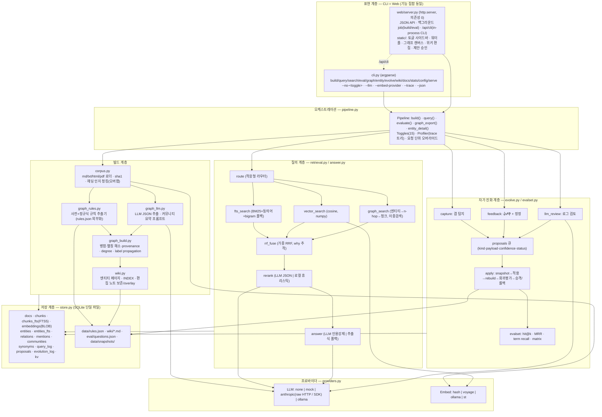
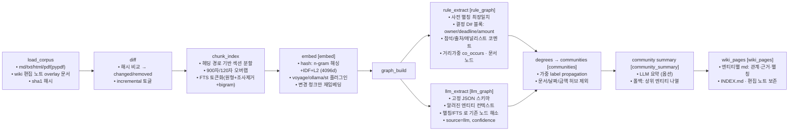
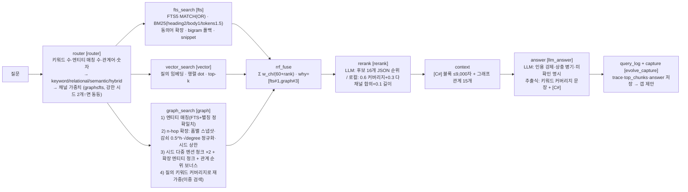
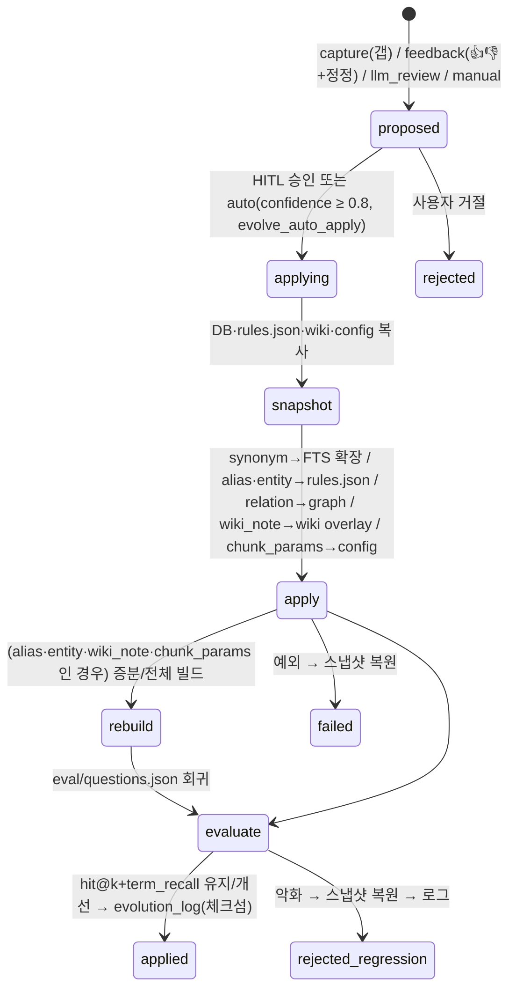

# LLM Wiki RAG — 전체 설계 리뷰 (요구사항·트렌드 반영도, 구조 도식, 기법, 장단점, 개선점)

작성일 2026-09-11 · 대상 코드 `llmwiki/` (3,600 라인, Python 3.7) · 검증 환경: API 키 없음, 로컬 전용

> 판정 기준 — ✅ 완전 반영(코드+검증) · 🔶 부분 반영(구조는 있으나 제한적이거나 미검증) · ❌ 미반영(설계 여지만 확보)

> **v2 갱신 (2026-09-11 저녁)** — 이 문서는 1차 구현 시점의 리뷰입니다. 이후 변경으로 아래 판정이 바뀌었습니다. 최신 상태는 [docs/ARCHITECTURE_V2.md](docs/ARCHITECTURE_V2.md) §11~§14 를 보세요.
> - 트렌드 ① cross-encoder 리랭크: ❌ → ✅ (`rerank_method=cross_encoder`, 미설치 시 로컬 폴백)
> - 트렌드 ⑤ MCP: ❌ → ✅ (`python -m llmwiki mcp`, 읽기 전용 도구)
> - 트렌드 ③ 실시간 리빌드: 🔶 → ✅(폴링) (stat_skip 증분 + auto_build 워처)
> - §5 개선점 중 "라우터·리랭커 휴리스틱 상수" → 82개 튜닝 파라미터로 외부화(`tuning.json`), "역할별 모델" → `llm_roles`, "요청별 프로파일" → requests 테이블 + Requests 탭

---

## 1. 요구사항 반영 매트릭스

### 1.1 사용자 요청 항목

| # | 요청 | 판정 | 구현 위치 | 비고 |
|---|---|---|---|---|
| R1 | 임베딩할 코퍼스 | ✅ | `config.py` `corpus_dirs`, `corpus.py` | Chapter2/data(md 16) + practice3(pdf 3, md 1, html 1) = 21 문서 |
| R2 | 코퍼스 build → indexing | ✅ | `pipeline.build()` | load → diff(sha1) → chunk/FTS → embed → graph → wiki, 증분/전체 |
| R3 | FTS 검색 | ✅ | `store.fts_search`, `retrieval.fts_search`, `textutil` | SQLite FTS5 BM25 + 한국어 조사 제거·문자 bigram + 동의어 확장 |
| R4 | Vectorization 검색 | ✅ / 🔶 | `providers.HashEmbedder` 외, `retrieval.vector_search` | 파이프라인은 완전 동작. 기본 임베딩은 오프라인 해시(의미 임베딩 아님) → Voyage/Ollama/ST 플러그인 준비 |
| R5 | Graph RAG 검색 | ✅ | `retrieval.graph_search` | 엔티티 매칭 → n-hop 확장(감쇠·차수 정규화·상한) → 멘션 청크 + 관계 근거 + 키워드 재가중 |
| R6 | 그래프 빌드: 파이썬 규칙 기반 | ✅ | `graph_rules.py`, `data/rules.json` | 사전(정규명·별칭·유형) + 정규식(담당/마감/금액/참석/출처/애널리스트/결정 D#/날짜/금액) + 거리가중 공동출현 |
| R7 | 그래프 빌드: LLM 기반 | 🔶 | `graph_llm.py`, `graph_build.py` | JSON 스키마 추출·별칭 해소·provenance 병합 구현, **mock 으로만 검증**(실 API 미호출) |
| R8 | 수정 필요한 data/index 의 self-evolving | ✅ | `evolve.py` | capture/feedback/llm_review → proposals → snapshot → apply → rebuild → 회귀평가 → 승격/롤백, evolution_log |
| R9 | 전체 구조 + 장단점 | ✅ | `ARCHITECTURE.md`, 본 문서 | |
| R10 | 실제 동작 코드 | ✅ | 전체 | build/query/eval/evolve/serve 실행 검증, unittest 7개 통과 |
| R11 | Web UI | ✅ | `web/server.py`, `web/static/*` | 10개 탭, 의존성 0 |
| R12 | Web UI 에서 CLI 전체 확인 | ✅ | `cli.run_captured`, `/api/cli`, Console 탭 | argparse 를 in-process 실행, 모든 액션에 동등 CLI 명령 표시 |
| R13 | 기능 하나하나 on/off 하며 결과 확인 | ✅ | `config.Toggles`(15개), 사이드바, `--no-*` 플래그 | 요청 단위 오버라이드 후 복원, eval `--matrix` 로 조합 비교 |
| R14 | 각 단계별 처리 확인 | ✅ | `profiler.py`, 워터폴 UI | 단계별 입력/출력 요약(match 식, top hits, seeds, usage) + skipped 사유 |
| R15 | 단계별 profile 장치 | ✅ | `Profiler.stage()` | ms·메타·에러·로그 트리, CLI `--trace`, 로그 재열람(Query Log 탭) |
| R16 | Plan 작성 | ✅ | `PLAN.md` | |
| R17 | 품질 개선용 멀티에이전트 프롬프트 제안 | ✅ | `MULTI_AGENT.md` | 오케스트레이터 + A1~A6 + R1/R2, 프롬프트 원문 포함 |

### 1.2 최신 트렌드(제공 보고서) 반영도

| 트렌드 | 판정 | 반영 내용 | 미반영/차이 |
|---|---|---|---|
| ① 하이브리드(FTS+Vector) + Cross-encoder 리랭킹이 표준 | ✅ / 🔶 | 3채널 RRF 융합, 리랭크 단계(LLM JSON 순위 / 로컬 커버리지·합의 휴리스틱) | cross-encoder(BGE-M3 등) 미탑재 — Python 3.8+ 필요. LLM 리랭크는 mock 검증 |
| ② GraphRAG 경량화 (LightRAG / LazyGraphRAG / DRIFT) | ✅ / 🔶 | LightRAG 식 **이중 검색**(엔티티 레벨 + 키워드 레벨) 기본, 커뮤니티 요약은 옵션(비용 0 기본) | LazyGraphRAG 의 "질의 시 동적 커뮤니티 선택·지연 요약", DRIFT 의 반복 탐색은 없음 |
| ③ 배치 → 이벤트 스트리밍 리빌드 (ES-GraphRAG) | 🔶 | 문서 해시 diff 증분 빌드(변경 청크만 FTS/임베딩/그래프 재생성), 위키 편집 노트 overlay | 파일 감시/Kafka 같은 이벤트 소스 없음(폴링·수동 빌드). 그래프 커뮤니티는 매 빌드 전체 재계산 |
| ④ DTG(데이터 변환 그래프) | ❌ | 관계 스키마(src,dst,rel,weight,source,confidence,chunk_id)가 provenance 를 갖도록 설계해 확장 여지 확보 | 대상이 문서 코퍼스라 코드 그래프 미적용 |
| ⑤ Self-evolving + MCP 통합 접근 | ✅ / ❌ | 자가 진화(제안 큐·회귀 평가·롤백·HITL) 구현 | MCP 서버 인터페이스 없음(JSON API 를 감싸면 됨) |
| 적응형 검색(Router: 단순→벡터, 복합→그래프) | ✅ | `retrieval.route` — keyword/relational/semantic/hybrid 분류, 채널 가중치 | 휴리스틱(학습 기반 아님) |
| 자가 진화 루프 악성 주입 리스크 → 샌드박스·서명·HITL | ✅ / 🔶 | 제안은 **데이터만** 수정(코드/프롬프트 불변), 스냅샷·롤백, 체크섬 로그, 기본 HITL, 자동승인 임계값 | 프로세스 격리·암호 서명 없음(체크섬 수준) |
| 하드웨어 제약 상실 환각 → 인용 강제 | ✅ | 답변 프롬프트 [C#] 인용 강제, 상충 병기, 미확인 명시, 인용 없는 답변은 갭으로 기록 | LLM 답변 품질 실측 미완 |
| 그래프 인덱싱 비용 병목 | ✅ | 규칙 추출 무료·결정적, LLM 추출은 변경 문서에만, 커뮤니티 요약 옵션 | |
| Guardrails(NeMo 등) | ❌ | 없음 | 로컬 전용 도구라 미도입 |

---

## 2. 전체 구조 도식

### 2.1 계층 구조 (기법 주석 포함)



### 2.2 빌드 파이프라인 (단계 = Profiler stage 이름)



### 2.3 질의 파이프라인



### 2.4 자가 진화 루프



### 2.5 데이터 모델 (SQLite)

```
docs(doc_id PK, path, title, kind, hash, meta, n_chunks, built_at)
chunks(chunk_id PK = doc_id#n, doc_id, ordinal, heading, text, start, end)
chunks_fts  FTS5(chunk_id, doc_id, heading, body, tokens)         ← 한국어 전처리 토큰 컬럼
embeddings(chunk_id PK, provider, dim, vec BLOB float32)            ← 프로바이더별 공존 가능
entities(entity_id PK = e:<정규명>, name, type, description, aliases JSON, source rule|llm|evolve(+), confidence, community, degree)
entities_fts FTS5(entity_id, name, aliases, description)
relations(rel_id PK, src, dst, rel, description, weight, source, confidence, chunk_id)   ← 근거 청크(provenance)
mentions(entity_id, chunk_id, doc_id, count, source)
communities(community PK, size, top_entities JSON, summary, source)
synonyms(term, expansion, source)                                    ← 자가 진화 산출물
query_log(id, ts, query, config, top_chunks, answer, scores, trace JSON, feedback, note)
proposals(id, ts, kind, payload JSON, reason, confidence, status, origin, applied_at, eval_before, eval_after)
evolution_log(id, ts, proposal_id, action apply|rollback|reject|fail, detail, checksum)
kv(k, v)                                                             ← hash_idf, last_build
```

### 2.6 토글 ↔ 단계 ↔ CLI ↔ UI 매핑

| Toggle | 영향 단계 | CLI | 기본 |
|---|---|---|---|
| rule_graph / llm_graph | rule_extract / llm_extract | `--no-rule-graph` `--llm-graph` | on / off |
| embed | embed | `--no-embed` | on |
| communities / community_summary | communities | `--no-communities` `--community-summary` | on / off |
| wiki_pages / incremental | wiki_pages / diff | `--no-wiki-pages` `--no-incremental` | on / on |
| fts / vector / graph | 각 검색 단계 | `--no-fts` … | on |
| router / rerank / llm_answer | router / rerank_* / answer_* | `--no-router` … | on |
| evolve_capture / evolve_auto_apply | query 로그·제안 / apply 자동 | `--no-evolve-capture` `--evolve-auto-apply` | on / off |

---

## 3. 적용된 기법 총목록

| 영역 | 기법 | 출처/근거 |
|---|---|---|
| 청킹 | 헤딩 경로 보존 섹션 청킹, 문단 경계 분할 + 오버랩, 최소 길이 필터 | 구조 문서(회의록·리포트)에 유리 |
| 한국어 FTS | 조사 사전 제거(최장일치), 혼합 스크립트 분리, 문자 bigram 보조 색인, MATCH 안전 인용, 동의어 질의 확장, bigram 폴백 | 형태소 분석기 없이 재현율 확보 |
| 벡터 | 해시 n-gram 임베딩(단어 + 한글 2/3-gram + 영문 3-gram, sublinear tf, IDF, L2), 프로바이더 추상화, 행렬 캐시 | 오프라인 기본 + 플러그인 |
| 그래프 구축 | 외부화 사전(별칭·유형), 도메인 정규식(결정 블록 스코프 한정), 거리 가중 공동출현, 문서 노드, LLM JSON 추출 + 알려진 엔티티 주입, 별칭/FTS 기반 노드 해소, provenance·confidence 병합, 가중 label propagation, 허브 제외 | 규칙+LLM 하이브리드 |
| 그래프 검색 | 엔티티 매칭(FTS + 별칭 정확일치 보너스), 홉별 스냅샷 확장, 감쇠 0.5^h, √degree 허브 정규화, 시드 상한, 시드 다중 멘션 우선, 관계 순위 보너스, 키워드 커버리지 재가중(이중 검색) | LightRAG 방향 |
| 융합/라우팅 | 가중 RRF(k=60), 채널 기여 추적(why), 휴리스틱 라우터(질의 유형 4종) | 적응형 검색 |
| 리랭킹 | LLM JSON 순위(후보 16), 로컬(커버리지·합의·길이) 폴백 | 하이브리드+리랭크 표준 |
| 답변 | 인용 강제 [C#], 상충 병기, 미확인 명시, 추출식 폴백, 컨텍스트 예산(9,000자) | 환각 억제 |
| 자가 진화 | 갭 탐지(시드 없음/저점수/무인용), 피드백 정정 → wiki overlay, LLM 로그 리뷰, 제안 중복 억제, 스냅샷/롤백, 회귀 평가 게이트, 체크섬 로그, HITL 기본, 자동 승인 임계값, 데이터 전용 수정 | 통제된 self-evolving |
| 증분 빌드 | 문서 sha1 diff, 삭제 문서 정리, 변경 청크만 재임베딩·재추출, 위키 편집 노트 overlay | 리빌드 비용 절감 |
| 관측성 | 단계 트리 프로파일러(ms·메타·skipped 사유·에러), CLI --trace, 워터폴 UI, trace 영구 저장, eval matrix | 단계별 확인·프로파일 |
| 인터페이스 | argparse 단일 진입점, Web 콘솔 in-process 실행, 요청 단위 토글 오버라이드+복원, 동등 CLI 표시, 백그라운드 job | CLI=Web 동형 |
| LLM 호출 | claude-opus-5 기본, effort(low/medium) 분리, refusal 폴백(server-side-fallback), 재시도(429/5xx), SDK/raw HTTP 자동 선택, mock | Anthropic 가이드 |

---

## 4. 장점 · 단점 (전체)

### 4.1 장점
1. **의존성 0 으로 전체가 동작** — Python 3.7 + numpy + pypdf 만으로 빌드·검색·그래프·자가진화·Web UI 까지. 실습/사내 배포 진입장벽 낮음.
2. **모든 단계가 토글·계측** — 15개 토글, 단계별 trace, eval matrix 로 "어떤 채널이 왜 기여했는지" 를 숫자로 확인.
3. **CLI 와 Web 의 기능 집합 동일 보장** — Web 은 CLI 를 실행하는 껍데기이므로 기능 드리프트가 없음.
4. **규칙 그래프의 설명 가능성·비용 0** — 관계마다 근거 청크·규칙·신뢰도가 남고 재현 가능. LLM 추출은 변경 문서에만.
5. **그래프가 실제로 검색에 기여** — 허브 정규화 후 graph 단독 hit@5 1.0, MRR 0.82(12문항). 관계형 질의에서 결정·담당·마감을 직접 근거로.
6. **자가 진화가 통제됨** — 데이터만 수정, 스냅샷·회귀 평가·롤백·체크섬·HITL. 보고서가 지적한 "자가 진화 루프 오염" 리스크에 직접 대응.
7. **사람의 지식이 자연스럽게 색인됨** — 위키 편집 노트가 overlay 문서로 재색인되는 경로(Karpathy 식 LLM wiki 의 사람-편집 루프).
8. **프로바이더 교체 무비용** — LLM/임베딩 인터페이스가 분리되어 키·모델·로컬 서버를 설정만으로 교체.

### 4.2 단점
1. **의미 임베딩 부재(기본 hash)** — vector 채널의 1.0 은 이 코퍼스의 어휘 중복 덕. 패러프레이즈 질의에 취약.
2. **LLM 경로 실측 없음** — 추출·리랭크·답변·LLM 리뷰는 mock 배선 검증만. 실제 인용 정확도·JSON 정합성·비용 미측정.
3. **평가셋 12문항** — 미세 회귀를 못 잡고, 자가 진화 게이트의 안전망이 얇음.
4. **한국어 처리 근사** — 조사 규칙·bigram 은 형태소 분석기 대체가 아님(복합어·활용형 누락).
5. **커뮤니티 품질** — co_occurs 간선 과밀로 3~4개 커뮤니티, label propagation 은 Leiden 대비 약함. 커뮤니티 요약이 검색 채널로 쓰이지 않음(글로벌 질의 "전체 흐름 요약" 에 약함).
6. **라우터·리랭커가 휴리스틱** — 학습/cross-encoder 없음.
7. **자가 진화 갭 탐지 정밀도 낮음** — 저신뢰 제안이 쌓일 수 있어 HITL 부담.
8. **스트리밍/이벤트 리빌드 없음** — 폴링·수동 빌드. 커뮤니티는 매번 전체 재계산.
9. **웹 서버 단일 프로세스·전역 락·무인증·무스트리밍** — 로컬 개발 도구 수준.
10. **PDF 품질 의존** — pypdf 텍스트 추출(표·그림 누락), 논문은 발췌본.
11. **규칙 사전 도메인 종속** — 새 코퍼스면 초기 사전 보강 필요(자가 진화가 점진 보강하지만 콜드스타트 있음).

---

## 5. 개선점 (우선순위)

### P0 — 즉시 (환경·검증)
- [ ] Python 3.11+ 가상환경 확보 후 `anthropic` SDK·`sentence-transformers`(다국어)·cross-encoder 설치 → LLM 추출/리랭크/답변·의미 임베딩 **실측**하고 eval 재기록
- [ ] 평가셋 60문항+ 로 확장(사실/담당·관계/멀티홉/논문/미존재), 카테고리별 집계, "미존재 문항은 인용 0개가 정답" 채점 (MULTI_AGENT R1)
- [ ] 인용 정확도 지표 추가(답변 [C#] 가 expect_chunk 를 가리키는 비율)

### P1 — 검색 품질
- [ ] 관계 유형별 확장 가중치(owner/deadline/amount/decides > co_occurs), 문서 노드 경유 확장 실험 (A1)
- [ ] 한국어: 복합명사 사전 분리, 숫자 정규화(2,800억↔2800억↔이천팔백억), 활용형 처리 또는 kiwipiepy 옵션 플러그인 (A2)
- [ ] cross-encoder 리랭커 플러그인(BGE-M3/ko-reranker), 라우터를 로그 기반 학습(질의 유형 → 최적 가중치)으로
- [ ] 커뮤니티: 가중치 임계·Leiden(networkx/igraph 옵션), **커뮤니티 요약을 글로벌 질의용 검색 채널로**(LazyGraphRAG 식: 질의 시 관련 커뮤니티만 지연 요약) (A4)
- [ ] 벡터 대규모화 대비 ANN(sqlite-vec/FAISS) 플러그인, 헤딩 가중 임베딩

### P2 — 자가 진화 고도화
- [ ] 갭 탐지 정밀도 측정(라벨링) 후 저정밀 규칙 보수화, 제안 중복/폭주 억제, kind 별 confidence 캘리브레이션 (A5)
- [ ] 회귀 판정을 "어떤 지표도 허용 오차 이상 악화 없음" 으로, 카테고리별 회귀 감시
- [ ] 스냅샷 보존 정책(최근 N), `evolve rollback <log_id>` CLI, 적용 diff 미리보기(dry-run)
- [ ] LLM 리뷰 제안의 근거 청크 첨부(설명 가능성), 제안 서명(HMAC) 및 출처 격리

### P3 — 리빌드/운영
- [ ] 파일 감시(watchdog) 또는 이벤트 큐로 변경 즉시 증분 빌드(ES-GraphRAG 방향), 커뮤니티 국소 재계산
- [ ] LLM 추출 결과 캐시(청크 해시 키) 및 배치 API 사용으로 비용 절감
- [ ] Web: A/B 비교 뷰, 토큰/비용 집계, 문항×조합 히트맵, 콘솔 히스토리, SSE 스트리밍 (A6)
- [ ] 인증·멀티 프로세스(FastAPI/uvicorn 전환), MCP 서버 래퍼(검색·엔티티·제안 도구 노출)

### P4 — 범위 확장
- [ ] 코드 코퍼스 대상 DTG(데이터 상태=노드, 변환=간선) 추출기 추가 — 현재 관계 스키마(provenance·weight) 재사용
- [ ] Guardrails(입력/출력 검사) 및 답변 수준 자기검증(self-check) 단계
- [ ] 표/그림 추출 강화(PDF 레이아웃 파서), HTML 대시보드의 수치 테이블 구조화

---

## 6. 요약 판정

- 사용자 요청 17개 항목 중 **15개 완전 반영, 2개 부분 반영**(LLM 그래프 빌드·의미 임베딩은 구조 완성·실측 미완, 원인은 API 키·Python 3.7 환경).
- 트렌드 5대 항목 중 **하이브리드+리랭크·경량 GraphRAG·자가진화(통제)·적응형 라우터·인용 강제**는 반영, **이벤트 스트리밍 리빌드는 증분 빌드 수준**, **DTG·MCP·Guardrails·cross-encoder 는 미반영(확장 지점만 확보)**.
- 가장 큰 다음 단계는 (1) 3.11+ 환경에서 LLM·의미 임베딩 실측, (2) 평가셋 확장 — 이 둘이 끝나야 나머지 개선의 효과를 신뢰성 있게 측정할 수 있습니다.
